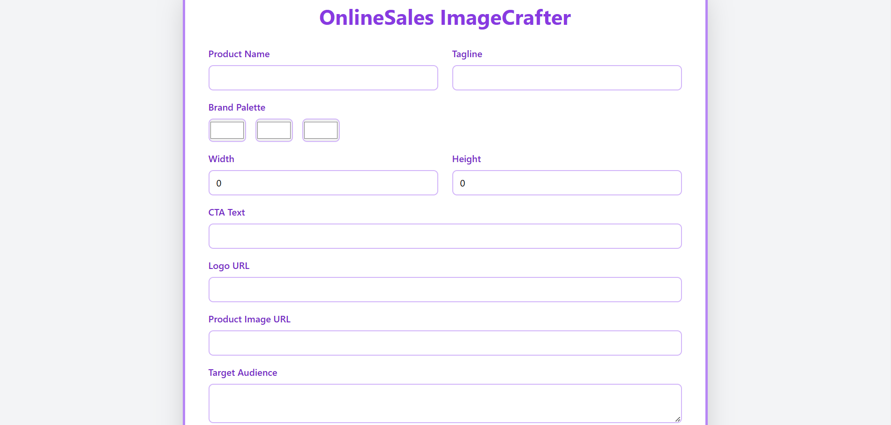
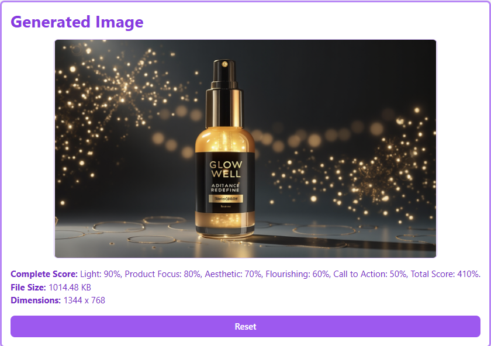

# OnlineSales ImageCrafter

OnlineSales ImageCrafter is a creative tool designed for generating customized promotional images based on user-provided parameters. It allows users to create image creatives for their products by inputting details such as product name, tagline, brand palette, target audience, and scoring criteria. This project leverages modern web technologies like React and Vite for fast development and seamless user experience.

## Deployed Links
Here are the details of my submissions:

**Documentation & PPT:**  https://www.canva.com/design/DAGaHafB9ss/7QcQts8n3LbKKa9qLg_FhA/edit

**GitHub Code Repository:** https://github.com/dhirajdj30/Nexus-OnlineSales-Image-Generation


**Demo Video:** https://drive.google.com/file/d/1PH-Wn357DeAAHKQgNGYPCJglYiCQyV7R/view?usp=sharing

- **Deployed Frontend**: [http://ethixlucifer.eastus2.cloudapp.azure.com:3001/](http://ethixlucifer.eastus2.cloudapp.azure.com:3001/)
- **Hosted API Server**: http://ethixlucifer.eastus2.cloudapp.azure.com:3000/ 

**Note** 
- that when you enter this URL in the browser the browser may automatically try connecting via https in that case manually renter the url with http in the URL header.

- When prompted that the site is not safe click on the advanced option and simply click on the proceed button.


## Features

- **Product Information**: Input product name, tagline, logo, product image, and other details.
- **Brand Palette**: Choose a set of colors for the brand's creative.
- **Dimensions**: Set custom image dimensions for the creative.
- **Scoring Criteria**: Provide custom scoring parameters to evaluate the generated image.
- **API Integration**: Submits data to an external API to generate the image and retrieve metadata, including file size, dimensions, and score.
- **Loader**: Shows a loading indicator while the image is being generated.
- **Result Page**: Displays the generated image and its metadata (file size, dimensions, and score).

## Technologies

- **Frontend**: React, Vite, Tailwind CSS
- **Backend**: Node.js (for API endpoint integration)
- **AI models used**: Llama 70B, Flux1-dev, MinGPT
- **Deployment**: Azure (Frontend Hosting), Azure (Backend), Replicate (Ai Model)

## Setup and Installation

Before running the project locally, ensure you have the following tools installed:

- Node.js (version 14 or higher)
- npm or Yarn (for package management)

# Steps to Setup:
##### Its important to first setup the server as it will run on port 3000.
## Server
1. **Clone the repository**:

   ```bash
   git clone https://github.com/dhirajdj30/Nexus-OnlineSales-Image-Generation
   
   cd Nexus-OnlineSales-Image-Generation
   
   cd server

   ```

2. **Install dependencies**:

   ```bash
   npm install
   ```

3. **Run the development server**:

   ```bash
   npm run dev
   ```

4. **Open the app in your browser**:

   Visit [http://localhost:3000](http://localhost:3000)

   ## Frontend
1. **Clone the repository**:
 After Cloning the repository cd into the root i.e, Nexus-OnlineSales-Image-Generation After that
   ```bash
   
   cd OnlineSales-Frontend

   ```

2. **Install dependencies**:

   ```bash
   npm install
   ```

3. **Run the development server**:

   ```bash
   npm run dev
   ```

4. **Open the app in your browser**:

   Visit [http://localhost:5173](http://localhost:5173)

## Frontend

The frontend is designed with a clean user interface where users can input their product details and select creative preferences. The main sections include:

- **Product Information**: Allows users to input product name, tagline, logo, and product image.
- **Brand Palette**: A color selection tool to define the brand's creative palette.
- **Dimensions**: Options to set the desired image dimensions.
- **Scoring Criteria**: Customizable parameters to score the generated image.
- **Generated Image**: Displays the image once it's created with file metadata (size, dimensions, score).

### Screenshot of the Frontend:



### Screenshot of the Output:



## API Request and Response

The tool communicates with an external API to generate the image based on the provided parameters. Below is an example of the request and response format.

### API Request

The request is a POST request that sends the input data to the server:

**Request URL:**
#### Hosted URL 

```bash
http://ethixlucifer.eastus2.cloudapp.azure.com:3000/evaluate
```

#### Local URL
```bash
http://localhost:3000/evaluate
```
```bash
POST /evaluate 
```

**Request Body:**

```json
{
  "creative_details": {
    "product_name": "GlowWell Skin Serum",
    "tagline": "Radiance Redefined.",
    "brand_palette": ["#FFC107", "#212121", "#FFFFFF"],
    "dimensions": {
      "width": 1080,
      "height": 1080
    },
    "cta_text": "Shop Now",
    "logo_url": "https://example.com/logo.png",
    "product_image_url": "https://replicate.delivery/yhqm/KTmXVxvup2aeEyQp31R3pjvTm1scQBIfWYeF7xVzmfBNecrfE/R8_FLUX_XLABS_00001_.webp",
    "target_audience":"Urban women aged 30-45, seeking premium skincare solutions"
  },
  "scoring_criteria": [
    { "parameter": "background_foreground_separation", "weight": 20 },
    { "parameter": "brand_guideline_adherence", "weight": 20 },
    { "parameter": "creativity_visual_appeal", "weight": 20 },
    { "parameter": "product_focus", "weight": 20 },
    { "parameter": "call_to_action", "weight": 20 }
  ]
}
```

### API Response

The API will respond with the generated image and metadata:

**Response Body:**

```json
{
    "status": "success or Fail",
    "creative_url": "generated image Link",
    "scoring": {
        "completeScore": "Score Given the the Model"
    },
    "metadata": {
        "file_size_kb": "size in KB",
        "dimensions": {
            "width": "width",
            "height": "height"
        }
    }
}
```

